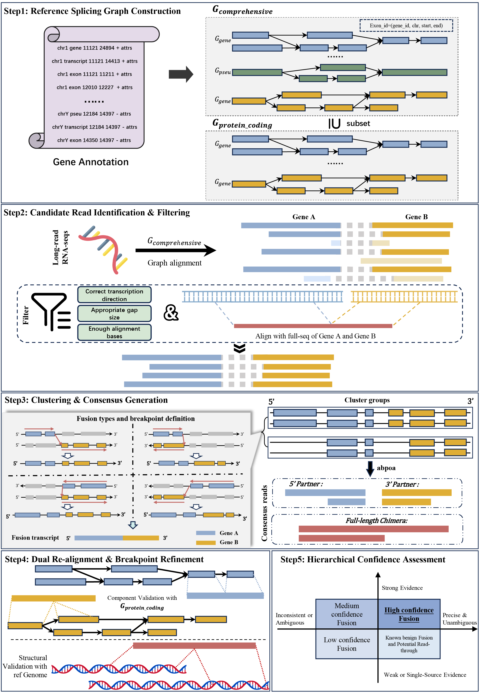

# GFSeeker: A Splicing-Graph-Based Approach for Accurate Gene Fusion Detection from Long-Read RNA Sequencing Data

## Overview
- [Introduction](#introduction)
- [Workflow](#workflow)
- [Dependencies](#dependencies)
- [Installation](#installation)
- [Usage](#usage)
  - [Quick Start](#quick-start)
  - [Step 1: Build Reference Graph](#step-1-build-reference-graph)
  - [Step 2: Detect Fusions](#step-2-detect-fusions)
- [Citation](#citation)
- [Contact](#contact)

---

## Introduction

**GFSeeker** is an innovative computational framework designed for the precise detection and in-depth characterization of gene fusions from **long-read RNA sequencing (PacBio, Oxford Nanopore) data**.

---
## Workflow

GFSeeker follows a five-step process for gene fusion detection.**Step 1**, Reference Splicing Graph Construction. **Step 2**: Candidate Read Identification and Filtering. **Step 3**: Clustering and Consensus Generation. **Step 4**: Dual Re-alignment and Breakpoint Refinement. **Step 5**: Hierarchical Confidence Assessment.



---

## Dependencies

GFSeeker relies on the following packages and tools.

**[minigraph]>=0.21 and [minimap2]>=2.28**: Must be installed and available in system's `PATH`.
```
1. python >= 3
2. mappy >= 2.29
3. pyabpoa >= 1.5.3
4. numpy >= 2.0.1
5. pyfaidx >= 0.8.1.3
6. pandas = 2.2.3
7. gcc >= 4.8.3
```

---
## Installation
### 1. Create a virtual environment  
```sh
#create
conda create -n GFSeeker python=3.9
#activate
conda activate GFSeeker
#deactivate
conda deactivate
```   
### 2. clone GFSeeker
* After creating and activating the GFSeeker virtual environment, download SVHunter from github:
```sh
git clone https://github.com/EmotionWaste/GFSeeker.git
cd GFSeeker
```
### 3. Install 
```sh
conda activate GFSeeker
conda install python 3.9, numpy, pandas, mappy, math, pyabpoa, pyfaidx
```
---

## Usage
GFSeeker is composed of two main steps:
1. **`graph`**: Constructs  reference splicing graph from a genome and its annotation.
2. **`detect`**: Aligns long reads to the graph to identify fusion transcripts.
```sh
usage: python GFSeeker [-h] {graph,detect} ...

positional arguments:
  {graph,detect}
    graph           Build the reference splicing graph
    detect          Detect gene fusions from long reads

optional arguments:
  -h, --help      show this help message and exit
```

### Quick Start
Here is a typical workflow to run GFSeeker:
```sh
# Step 1: Build the reference splicing graph using your genome and annotation
GFSeeker graph human_genome.fa gencode.v47.annotation.gff3 -o ./ref_graph -t 16

# Step 2: Detect fusions in your long-read RNA sequencing data
GFSeeker detect long_reads.fasta human_genome.fa ./ref_graph -o ./result -t 16
```

### Step 1: Build Reference Graph
```sh
usage: python GFSeeker graph [-h] [-t int] [-o dir] [-l str] <gff_path> <ref_path>

positional arguments:
  <gff_path>          Path to gene annotation file (gff3)
  <ref_path>          Path to reference genome file (fasta)

options:
  -h, --help          show this help message and exit
  -t, --threads int   Number of threads to use (default = 8)
  -o, --output_dir dir
                      Directory to store graph output files (default = ./graph_ref/)
  -l, --log_file str  Path to log file (default = graph_build.log)
```
**Note:**
1. the annotation only support GENCODE currently.
2. need to download fusion_annot_lib(https://github.com/FusionAnnotator/CTAT_HumanFusionLib) into the **output_dir**

### Step 2: Detect Fusions
```sh
usage: python GFSeeker detect [-h] [-o str] [-t int] [-k int] [-w int] [-m str] [-s int] [-l int] [-g int] [-c int] [-d int] [-O int] [-T int] [-M bool] [-P bool] <readfile> <ref_path> <ref_dir>

positional arguments:
  <readfile>            Read file (fasta/fastq)
  <ref_path>            Path to reference genome file
  <ref_dir>             Index directory

optional arguments:
  -h, --help            show this help message and exit
  -o, --output_dir str
                        the name of fusion result (default = "./result")
  -t, --threads int
                        Number of threads to use, default is 8
  -k, --graph_aln_k int
                        Minigraph k-mer size (default = 12)
  -w, --graph_aln_w int
                        Minigraph minizer window size (default = 1)
  -m, --graph_aln_m str
                        Minigraph minimal graph/linear chaining score (default = 30,20)
  -s, --min_supporting_reads int
                        Minimum reads number to support gene fusions (default = 2)
  -l, --min_block_length int
                        Minimum read length for fusion detection (default = 30)
  -g, --max_gap_length int
                        Maximum gap length between two genes that a read maps to (default = 200)
  -c, --min_cseq_length int
                        Minimum length of the generated partial consensus sequence (default = 30)
  -d, --bp_cluster_distance int
                        Maximum distance of breakpoint cluster (default = 30)
  -O, --max_gap_one_aln int
                        Maximum length of the mappy condition ONE_ALIGNMENT (default = 30)
  -T, --max_gap_two_aln int
                        Maximum length of the mappy condition TWO_ALIGNMENTS (default = 15)
  -M, --skip_chrM bool
                        Skip chrM in fusion detection (default = True)
  -P, --only_keep_pcgene bool
                        Only keep protein-coding genes in fusion detection (default = True)
```

#### Optional Arguments:
| Parameter | Description | Default |
|---|---|---|
| Output & Threads | | |
| -o, --output_dir | Output directory for fusion results | ./result |
| -t, --threads | Number of threads to use | 8 |
| Graph Alignment | | |
| -k, --graph_aln_k | Minigraph k-mer size for seeding | 12 |
| -w, --graph_aln_w | Minigraph minimizer window size | 1 |
| -m, --graph_aln_m| Minigraph minimal graph/linear chaining score | "30,20" |
| Fusion Filtering | | |
| -s, --min_supporting_reads | Minimum number of reads required to support a fusion event | 2 |
| -l, --min_block_length | Minimum aligned length of a read segment on a gene | 30 bp |
| -d, --bp_cluster_distance | Maximum distance to cluster similar breakpoints | 30 bp |
| -g, --max_gap_length| Maximum gap between gene segments on a single read | 200 bp |
| -c, --min_cseq_length | Minimum length of the generated partial consensus sequence | 30 bp |
| Advanced Filtering | | |
| -O, --max_gap_one_aln | Max gap allowed by mappy for re-alignment (ONE_ALIGNMENT) | 30 bp |
| -T, --max_gap_two_aln | Max gap allowed by mppy for re-alignment (TWO_ALIGNMENTS)| 15 bp |
| -M, --skip_chrM | Skip alignments to the mitochondrial chromosome | True |
| -P, --only_keep_pcgene | Only report fusions involving protein-coding genes | True |

---


## Citation
## Contact

[minigraph]:https://github.com/lh3/minigraph
[minimap2]:https://github.com/lh3/minimap2
